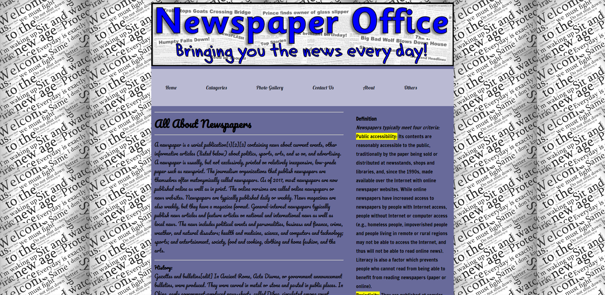

# News Site Home Page

## Using tools

- HTML
- CSS

## Features

1. User Friendly
2. Article View
3. Column Section Divided
4. Responsive 
5. Simple and Easy

> HTML SAMPLE

```HTML
				<div class="content">
					<hr>
					<h1>All About Newspapers</h1>
					<hr>
					<p>A newspaper is a serial publication[1][2][3] containing news about current events, other informative articles (listed below) about politics, sports, arts, and so on, and advertising. A newspaper is usually, but not exclusively, printed on relatively inexpensive, low-grade paper such as newsprint. The journalism organizations that publish newspapers are themselves often metonymically called newspapers. As of 2017, most newspapers are now published online as well as in print. The online versions are called online newspapers or news websites. Newspapers are typically published daily or weekly. News magazines are also weekly, but they have a magazine format. General-interest newspapers typically publish news articles and feature articles on national and international news as well as local news. The news includes political events and personalities, business and finance, crime, weather, and natural disasters; health and medicine, science, and computers and technology; sports; and entertainment, society, food and cooking, clothing and home fashion, and the arts.<hr>
													
					<b>History:</b><br>
					Gazettes and bulletins[edit]
					In Ancient Rome, Acta Diurna, or government announcement bulletins, were produced. They were carved in metal or stone and posted in public places. In China, early government-produced news-sheets, called Dibao, circulated among court officials during the late Han dynasty (second and third centuries AD). Between 713 and 734, the Kaiyuan Za Bao ("Bulletin of the Court") of the Chinese Tang Dynasty published government news; it was handwritten on silk and read by government officials. In 1582, there was the first reference to privately published newssheets in Beijing, during the late Ming Dynasty.</br>
					<br>
					In Early modern Europe the increased cross-border interaction created a rising need for information which was met by concise handwritten news-sheets, called avvisi. In 1556, the government of Venice first published the monthly Notizie scritte, which cost one gazetta, a small coin.[10] These avvisi were handwritten newsletters and used to convey political, military, and economic news quickly and efficiently to Italian cities (1500–1700)—sharing some characteristics of newspapers though usually not considered true newspapers.[11] However, none of these publications fully met the classical criteria for proper newspapers, as they were typically not intended for the general public and restricted to a certain range of topics.</br>

					<br>
					<i>Newspapers:</i><br>
					Main article: History of newspaper publishing</br>
					See also: List of the earliest newspapers and Newspaper production process.</br>
					</p>
                </div>
```

> CSS SAMPLE

```CSS
.mainmenu{background:#babad3; font-family: 'Lobster', cursive;}
	.mainmenu ul{margin:0; padding:0; list-style:none}
		.mainmenu ul li{display:inline-block;}

			.mainmenu ul li a{color:#111524;padding:45px;display:inline-block;text-decoration:none}

				.mainmenu ul li a:hover{background:#e7ebee}
```


> Sample Landing Page




> Contact With Developer:

### Saikat Roy

> Email: njmsaikat@gmail.com

> Personal Portfolio: https://njmsaikat.github.io/saikat/

> Linked In Profile: https://www.linkedin.com/in/njmsaikat/
